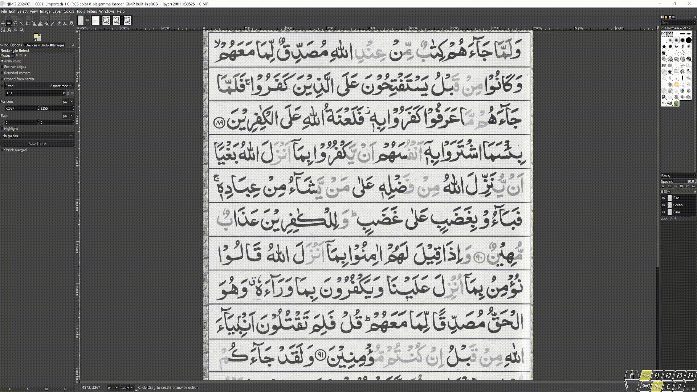
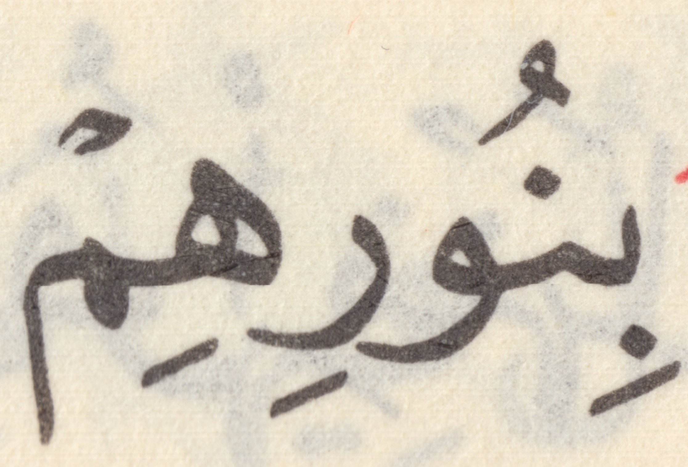
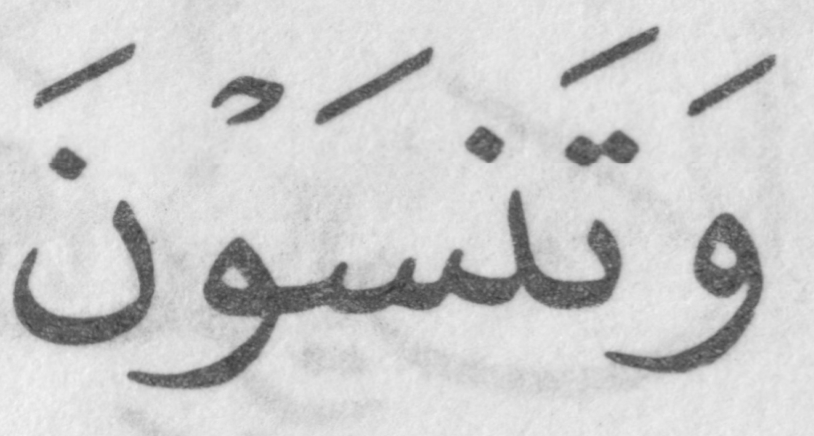
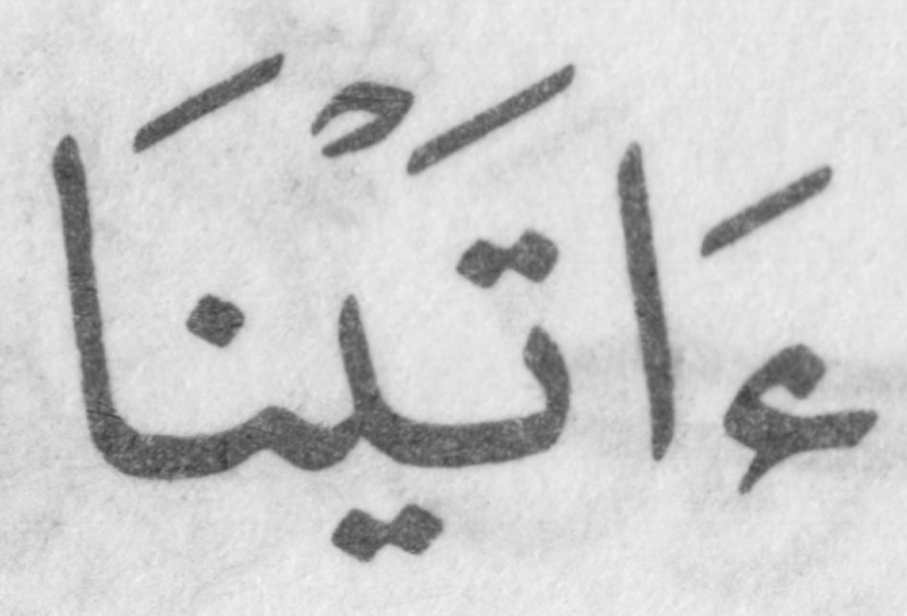
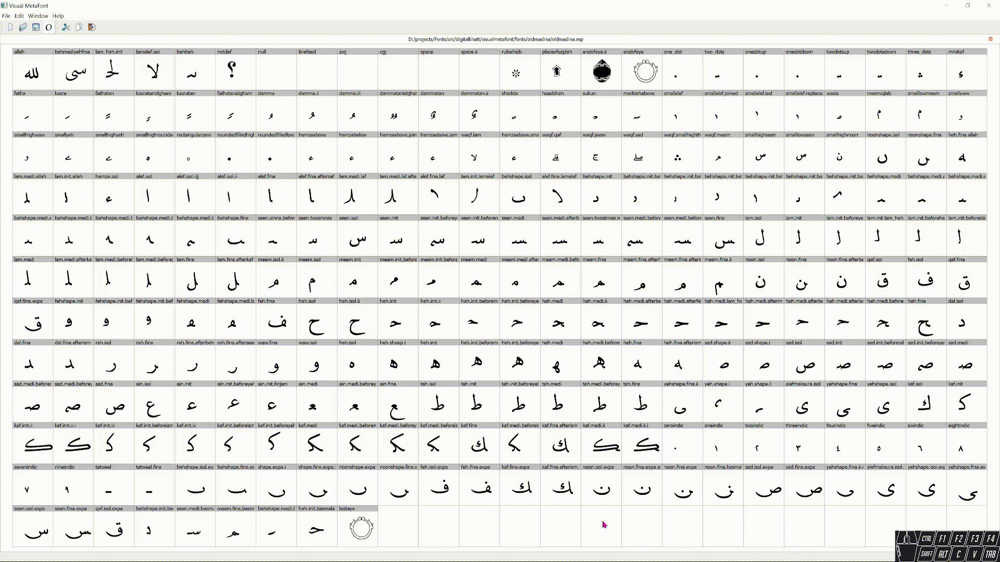
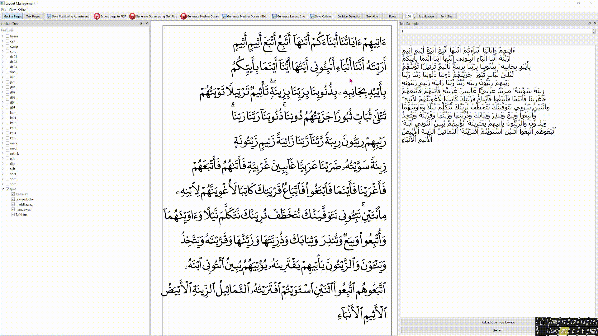
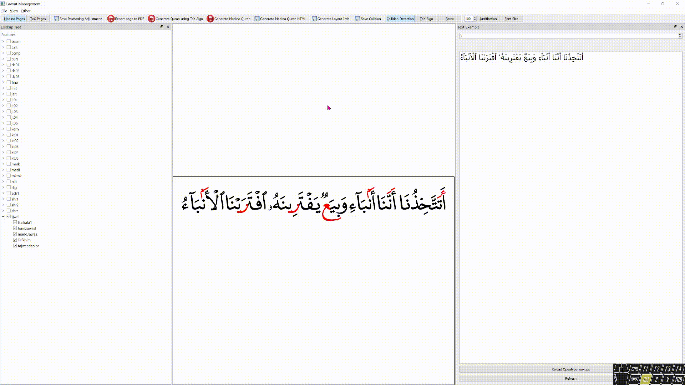
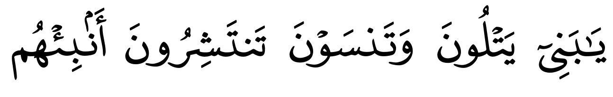
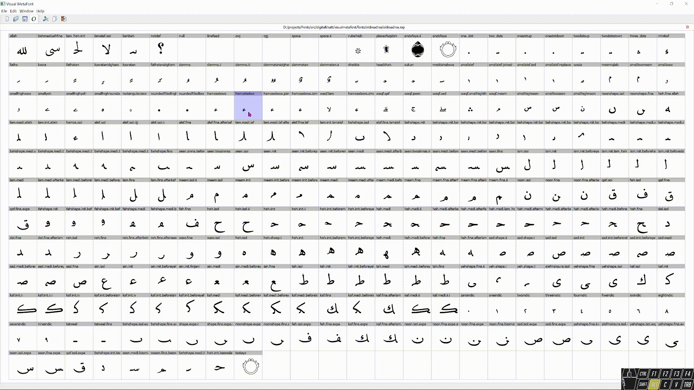
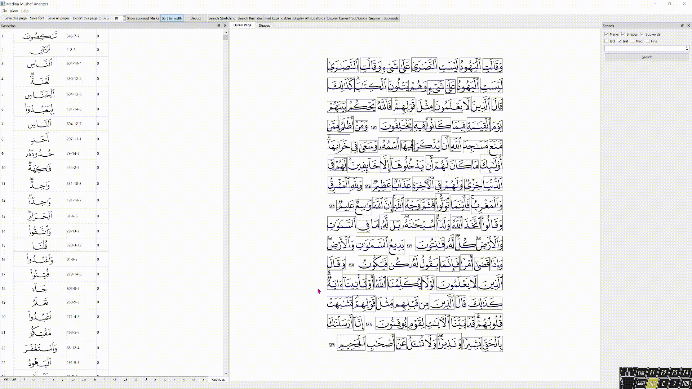

# VisualMetaFont

A graphical tool developed to allow the design of the Metafont-based dynamic font used in the DigitalKhatt typesetter

This project is sponsored by [@tarteelAI](https://github.com/TarteelAI) [](https://www.tarteel.ai/)

## Key Workflow Steps in the Development Of a New DigitalKhatt Font

The primary tool used for the design of a DigitalKhatt font is VisualMetaFont. It was developed initially as a tool to help in the design of the new Madinah Mushaf font and the digital Mushaf. Hence many features are specific to that font and the Quran typesetting and are hard coded in the tool. With the development of the old Madinah font, some of these hard coded and specific features were eliminated however many still exist and the process of making it more general and more font designer friendly is ongoing.

In this section, an overview of the key workflow steps for designing a new DigitalKhatt font is presented.

### Create a new VisualMetaFont project

As an example we will design a new font based on the IndoPak Mushaf.

A font project in VisualMetaFont is composed of MetaFont files (.mf), a feature file (automedina.fea), a parameters.json file, C++ files and image files. The C++ files are under the folder [src/automedina](src/automedina) and the other files are under the folder [fonts/<`fontName`>](fonts).

 To create the new IndoPak font, first you copy the folder of an existing font such as [fonts/oldmadina](fonts/oldmadina) to the new directory fonts/indopak and replace oldmadina.mp by indopak.mp. Then you create indopak.cpp and indopak.h from [oldmadina.cpp](src/automedina/oldmadina.cpp) and [oldmadina.h](src/automedina/oldmadina.h) respectively, and change the class `OldMadina`by `IndoPak`. The two new file names should be added to the file [CMakeLists.txt](src/CMakeLists.txt#L96) under the variable `Automedina`. Finally, you add the support of the new font in [OtLayout.cpp](src/Layout/OtLayout.cpp#L1146) :
 
 ```cpp
 if (strcmp(mp->job_name, "digitalkhatt") == 0) {
  automedina = new digitalkhatt(this, mp, extended);
}
else if (strcmp(mp->job_name, "oldmadina") == 0) {
  automedina = new OldMadina(this, mp, extended);
}
else if (strcmp(mp->job_name, "indopak") == 0) {
  automedina = new IndoPak(this, mp, extended);
}
else {
  throw new std::runtime_error("invalid font");
}
 ```

 Once the project is build and run, you can start editing the font by opening the file indopak.mp.

 

 ### Edit the font glyph shapes

 Continuing with the Indopak font, we take as example the final Alef form. First you prepare the glyph image that it will be traced to generate the vector representation of the glyph. To do this, you can scan a page of the Mushaf, crop the word containing this form, scale it if necessary (To have the Alef height between 600 and 700 UPEM), and save the image in jpeg format in the fonts/indopak/images folder.

 

 Then you open the image in the glyph window and you determine the value of the baseline height to match the height of the glyph image's baseline. Next you assign the value to the the variable `lineheight` in the file mpguifont.mp. You have to close and reopen the editor to take the new value into account.


 
 Finally you start editing the glyph shape by tracing manually the image.


### Specify the substitution and positioning rules

Once the glyph shapes are ready, you have to define the [OpenType substitution and positioning](https://learn.microsoft.com/en-us/typography/script-development/arabic) rules that specify, given a list of Unicode characters, which glyph forms to output and in what position based on their surrounding characters.  All the rules are defined in the file automedina.fea. VisualMetaFont is based on [Adobe OpenType™ Feature File Specification](https://adobe-type-tools.github.io/afdko/OpenTypeFeatureFileSpecification.html) to define such rules with some additions such as :

- Perl regular expressions on glyph names to define a set of glyphs. A glyph name follow the pattern `<Arabic Character>.<Positional Variant>...`. So to select all the medial Lams, one can use the following regular expression: `/^lam\.medi/`.
- Optional (`?`) and repetition operators (`{min,max}`) to define a sequence of character sets as follows
  ```
  sub [/init(?![.]*added)/]' (/medi(?![.]*added)/{0,5})' /behshape.medi/'lookup jt02.expa.1.1	/behshape.medi/'lookup jt02.expa.1.2	(/medi(?![.]*added)/{0,5})' /[.]fina(?![.]*added)/';  
  ```
- Anchors can be defined by functions as follows.
  ```
   lookup hamzaabovebelow.l1 {					
    pos base  [/^behshape[.]medi/ /^behshape[.]init/  /yehshape|alefmaksura/ /waw/] <anchor function defaultbaseanchorforlow> 
      markClass hamzabelow <anchor function defaullowmarkanchor> @hamzabelow ;
  } hamzaabovebelow.l1;
  ```
  The `defaullowmarkanchor` function name uses the following C++ functor.

  ```cpp
  class Defaullowmarkanchor : public AnchorCalc {
  public:
    Defaullowmarkanchor(Automedina& y, MarkBaseSubtable& subtable) : _y(y), _subtable(subtable) {}
    QPoint operator()(QString glyphName, QString className, QPoint adjust, double lefttatweel = 0.0, double righttatweel = 0.0) override {

      GlyphVis* glyph = &_y.glyphs[glyphName];

      if (lefttatweel != 0.0 || righttatweel != 0.0) {
        GlyphParameters parameters{};

        parameters.lefttatweel = lefttatweel;
        parameters.righttatweel = righttatweel;

        glyph = glyph->getAlternate(parameters);
      }

      int width = glyph->width * 0.5;
      int height = glyph->height;

      width = width + adjust.x();
      height = height + adjust.y();

      return QPoint(width, height);
    };
  private:
    Automedina& _y;
    MarkBaseSubtable& _subtable;
  };
  ```

  It sets the anchor at the middle of the top edge of a mark glyph.

### Example: Add a new ligature  to the old Madinah font 

As an example we will add to the old Madinah font the following ligature composed of the initial and medial Beh shapes.



First you trace the image to define the outline of the ligature as follows.


Second you have to split the ligature into individual glyphs so it will be more convenient to apply styling for each glyph separately, such as tajweed colors. To do so you define two variables `z1` and `z2` and call the function `cutGlyph` to split the glyph.


Also you have to define the `leftanchor` for the initial Beh shape and the `rightanchor` for the medial Beh shape. Those anchors will be  added automatically to the OpenType rule for cursive joining. Here the code for each glyph.

```mp
defchar(behshape.init.beforebeh,-1,-1,-1,-1);
%%beginbody

behbeh_(lefttatweel,righttatweel);

cutGlyph(z1,z2,true);

leftanchor := z2;

enddefchar;

defchar(behshape.medi.afterbeh,-1,-1,-1,-1);
%%beginbody

behbeh_(lefttatweel,righttatweel);

cutGlyph(z1,z2,false);

rightanchor := z2;

enddefchar;
```

Also since `behshape.medi.afterbeh` is left expandable it must be added to the array `expandableGlyphs` in `oldmadina.cpp`

```cpp
layout->expandableGlyphs["behshape.medi.afterbeh"] = { 20,-0.5,0,0 };
````
and to the class `@haslefttatweel`in automedina.fea.

Next you need to define the OpenType rules that specify when the ligature is applied. For this, a calligrapher or Arabic designer will be of great help. Otherwise by analyzing the Mushaf we can come out with certain calligraphic rules for this specific naskh script. For this example we consider that the ligature is always applied unless it is followed by a Seen or a Beh shape. In this case we should have the following shape defined by the `behshapeseen` lookup (.i.e arrangement of rules).



or the following shape defined by `multiplebehshape`



So we can add a new lookup after `multiplebehshape` as follows.

```fea
lookup behbehinit {
  feature rclt;

  lookupflag UseMarkFilteringSet [smallalef smallalef.joined hamzaabove.joined];

  lookup behbehinit.l1 {
      sub behshape.init by behshape.init.beforebeh;
      sub behshape.medi by behshape.medi.afterbeh;      
  } behbehinit.l1;  

  sub [behshape.init]'lookup behbehinit.l1   [behshape.medi]'lookup behbehinit.l1;

} behbehinit;
```

Note that you should not apply the ligature if there is a hamza or Subscript Alef between the letters.

Now you have to adjust the positions of the diacritical marks. The tool can scan all the Quran text and generate all the words having collision or very close glyphs.



The result is generated in the file output/overlaps.txt. You can copy the generated words to the layout window and adjust the marks graphically. Each time you change the position of a glyph the corresponding lookup is displayed in the console.



It is possible that changing the position of one glyph affects the others since many rules are applied to sets of glyphs. It is therefore necessary to make other passes to check that there have been no other collisions. If this is the case many alternatives are possible such as increasing the default width of the glyph, split a rule in two or more rules or add a new specific rule for the sequence of glyphs generating the collision. To simplify defining new rules you can select and copy the sequence of glyphs causing the collision and use it in the contextual rules.



Here the result for the words `يَٰبَنِيٓ يَتْلُونَ وَتَنسَوْنَ تَنتَشِرُونَ أَنۢبِئْهُم`



### Justification

During the development of DigitalKhatt, three justification techniques have been experimented. In this section, a brief description of each technique is presented. For further details, please refer to the code. Once they become more stable more detail will be put in this section.

The first justification algorithm is implemented in [an extended version of HarfBuzz](https://github.com/DigitalKhatt/harfbuzz/blob/justification/src/hb-ot-layout-jtst-context.cc#L48) using [a new justification table syntax](https://github.com/DigitalKhatt/visualmetafont/blob/master/fonts/digitalkhatt/automedina.fea#L2268). It uses two variables, `lefttatweel` and `righttatweel`, to specify an extended version of a glyph. Please refer to  [TUGboat article](https://www.tug.org/TUGboat/tb42-3/tb132anane-variable.pdf) for more details. A demo based on this approach using WebAssembly is available at [https://digitalkhatt.org/digitalmushaf](https://digitalkhatt.org/digitalmushaf)

Since the first approach needs a deployment of a custom version of HarfBuzz, a second technique was developed using only standard OpenType. For each expandable glyph, multiple alternates having different widths are generated into the font. The justification rules are defined using standard OpenType rules and organized into [features](https://github.com/DigitalKhatt/visualmetafont/blob/master/fonts/oldmadina/automedina.fea#L2570). The justification algorithm, which is external to the font, choose which feature to apply by word.A demo based on this approach is available at https://digitalkhatt.org/otf/oldmedina.

A [third approach](https://github.com/DigitalKhatt/digitalkhatt.org/blob/master/ClientApp/src/app/components/hboldmedina/just.service.ts#L229) has been experimented where the justification rules are also external to the font. In this case the client has total control over the justification by choosing which character should be extended and by what value. To do this, it is necessary to be able to specify OpenType features by character in the same run which is not widely supported natively as for common browsers. A demo based on this approach is available at https://digitalkhatt.org/hb/oldmedina


### Generate the fonts for production

The first justification technique above uses an extended version of OpenType variable font. This extended version can be generated from the menu `File->Generate OpenType CFF2 Extended` of the Layout Management window. The file is saved into output/<`fontname`>.otf.

The second and third techniques above use standard OpenType which can be generated from the menu `File->Generate OpenType CFF2 Standard`. The file is saved into output/<`fontname`>.otf.



To do some cleanup and optimization to the font or to generate a WOFF or WOFF2 format,  you can use the `ttx` command of [fonttools](https://github.com/fonttools/fonttools). 

```
ttx -o oldmadina.ttx oldmadina.otf
ttx --flavor woff2 -o oldmadina.woff2 oldmadina.ttx
ttx -o oldmadina.otf oldmadina.ttx
```

## Other Tools

### Quran Text Generator

The [Quran text generator tool](https://github.com/DigitalKhatt/visualmetafont/tree/master/tools/QuranTextGenerator) is used to generate the Quran Unicode text from [KFGQPC Word Mushaf](https://fonts.qurancomplex.gov.sa/wp02/en/%D8%AD%D9%81%D8%B5/#05) with some [minor changes](https://github.com/DigitalKhatt/visualmetafont/blob/master/tools/QuranTextGenerator/QPCDoc.cs#L202). The Quran text is saved in [quran.cpp](https://github.com/DigitalKhatt/visualmetafont/blob/master/src/qurantext/quran.cpp) file and used in Visual MetaFont to test and verify the results.

### New Madinah Mushaf Analyzer

The [Madinah Mushaf Analyzer](https://github.com/DigitalKhatt/medinamushafanalyzer) takes the [vectorized file of the Hafs handwritten Madinah Mushaf](https://dm.qurancomplex.gov.sa/hafsdownload/) of 1441 Hijri (2019) and tries to segment the curves into words, sub words and characters. It is not complete yet but it is already useful to infer certain font characteristics and justification rules. It is used also to generate the glyph raster images to design the glyph outlines of the second version of the new Madinah Mushaf font.

 
 